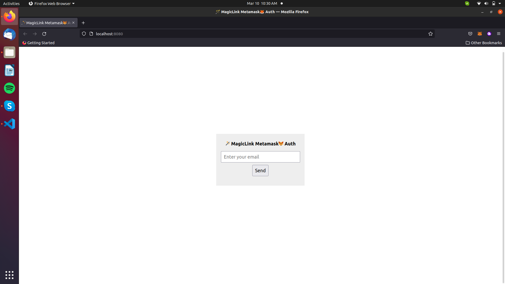
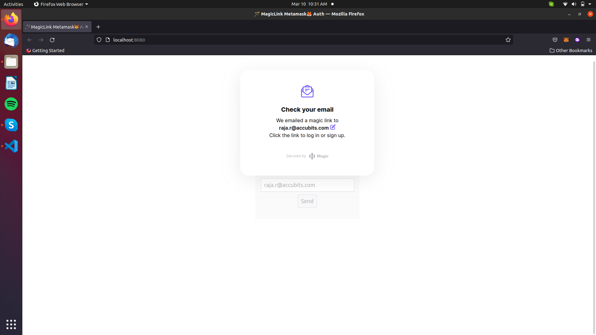
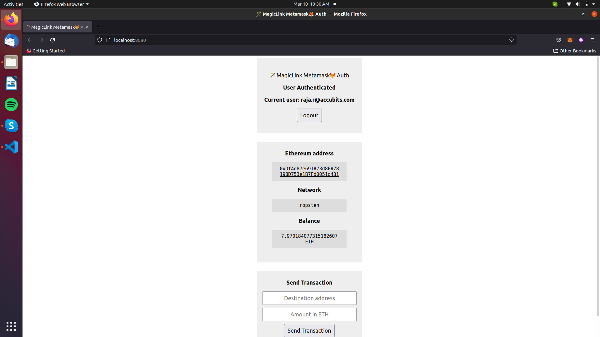

# 🪄 MagicLink Metamask 🦊 Authentication 🔐 NodeJS

- This Project is a Sample Template of 🪄 MagicLink Metamask 🦊 Authentication 🔐 for getting familiar in feature of Authenticating Metamask Via MagicLink..
- This Template Illustrates how to create a magiclink auth for metamask in Nodejs.

## Pre-Requisites 🧰
- Go to Magiclink Offical Website
- Get `PUBLISHABLE_API_KEY` 🔑 form MagicLink Dashboard
- Get `SECRET_KEY` 🗝️ form MagicLink Dashboard
```
const magic = new Magic("Paste yor PUBLISHABLE_API_KEY");
```
- Paste the `PUBLISHABLE_API_KEY` in above code which is loacted in `line no.13` in `index.html` file.
## Getting started 📖

📁 Create a new folder in VS code.  
- Open Your termial in Vscode and following commands. or press  `Ctrl+Shift+` `

🏃 Run: -- To Initalize Node.  ( Here `-y` means we are saying `yes` to all steps in node creation )
```
npm init -y
```


## Node Dependencies 🎒
Try ` npm i ` in cmd to install all nessecary dependencies mentioned in `package.json` file

or use 

``` 
npm install dotenv 
```
``` 
npm install http-server
```
``` 
npm install magic-sdk
```
``` 
npm install web3
```
``` 
npm install ethers
```
## To Run 🏃

 Run: -- To start http server and run Magiclink Metamask authentication.

```
npm start
```
## Screeshot 👀
### Enter Your Email ID 📭 you get a MagicLink 🪄.


### MagicLink 🪄  is will sent E-mail 📨 to your account.
#
#### Caution ⚠️ : Dont close your current tab go to new tab and login to your mail.


### Check you Email 📭 and click login 🚪.
### After Authentication go back to current tab.

### Now you can see your successfully Authenticated your Metamask 🦊 via Web Browser 🌐.

